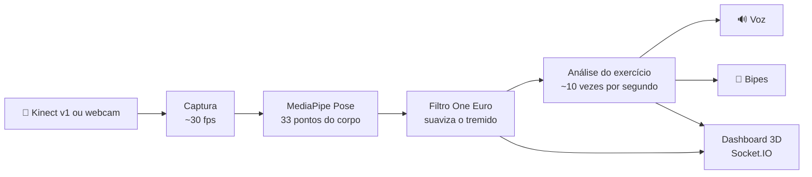

<p align="center">
  
</p>

<p align="center">
  
  
  
  
  
  
</p>

<p align="center">
  
</p>

<p align="center">
  <a href="#-o-que-é">O que é</a> ·
  <a href="#-como-funciona">Como funciona</a> ·
  <a href="#-exercícios">Exercícios</a> ·
  <a href="#-início-rápido">Início rápido</a> ·
  <a href="#-controle-por-voz">Voz</a> ·
  <a href="#-estrutura-do-projeto">Estrutura</a> ·
  <a href="#-solução-de-problemas">Problemas?</a>
</p>

---

## 🦾 O que é

**GuiaMove** (chamado de *SeeMove* no código e nos atalhos) é um coach de exercícios pensado para **pessoas cegas ou com baixa visão**. Uma câmera (Kinect v1 ou webcam) acompanha o corpo, o **MediaPipe Pose** localiza as articulações e o sistema **fala** o que corrigir, como "joelho esquerdo para dentro" ou "tronco inclinado para a direita", sem que a pessoa precise olhar para tela nenhuma.

- 🎙️ **Guiado por voz:** o sistema explica o exercício, corrige a postura e conta as repetições em voz alta; dá para controlar tudo falando.
- 🧍 **Sem nada no corpo:** sem sensores de pressão, Wii Balance Board ou Arduino. Só uma câmera.
- 🖥️ **Painel para quem acompanha:** dashboard no navegador com o vídeo, um **boneco 3D** que espelha o movimento, indicadores de desvio postural e o histórico do que foi falado.
- 📄 **Relatório da sessão** em CSV, para acompanhar a evolução.

## 🧠 Como funciona



1. **Captura:** o Kinect entrega a imagem por uma ponte nativa (C++ → memória compartilhada); uma webcam comum entra pelo OpenCV.
2. **Pose:** o MediaPipe (modelo *lite*) estima 33 pontos. A detecção roda na imagem original e só depois o x é espelhado, para esquerda e direita não trocarem.
3. **Suavização:** um One Euro Filter tira o tremido sem atrasar o movimento (~17 ms).
4. **Análise:** cada exercício roda suas checagens e o **problema mais grave vence**. No agachamento, uma correção só é falada depois de se repetir por alguns quadros seguidos, para não gerar alarme falso.
5. **Feedback:** voz (no navegador ou no motor local), bipes e o painel, sempre coordenados para uma fala nunca cortar a outra.

Antes de qualquer exercício há uma **calibração de enquadramento** falada: o sistema avisa se falta luz, se a cabeça ou os pés estão cortados ou se a pessoa precisa andar para o lado, e só começa quando o enquadramento fica estável.

## 💪 Exercícios

| Exercício | O que avalia | Extra |
|---|---|---|
| **Agachamento** (`squat`) | valgo do joelho, inclinação lateral do tronco, simetria entre os joelhos | conta repetições (meta: 5), avisa quando a repetição não vale, por exemplo se ficou raso |
| **Postura estática** (`stand`) | simetria de ombros e quadril, inclinação do tronco | avaliação em pé, sem contagem |
| **Equilíbrio unipodial** (`balance`) | elevação da perna, oscilação do tronco, queda do quadril (Trendelenburg) | avisa risco de queda |

## 🚀 Início rápido

### Requisitos

- **Windows** (a ponte do Kinect só existe para ele; testado no Windows 11)
- **Python 3.14** (versão em que foi testado)
- Uma câmera: **Kinect v1** ou uma webcam
- Navegador **Chrome ou Edge**. O controle por voz usa o reconhecimento de fala deles.

### Instalar

```bash
pip install -r requirements.txt
```

O modelo `pose_landmarker.task` (~6 MB) é baixado sozinho na primeira execução, se não estiver em `core/`.

### Rodar

| Situação | Como |
|---|---|
| **Kinect v1** (o caso da demonstração) | duplo clique em `Iniciar_SeeMove.bat` |
| **Webcam** | duplo clique em `Iniciar_SeeMove_Webcam.bat` |
| Sem câmera, só para ver o painel e a voz | `python main.py --no-camera` |

O painel abre sozinho em **http://127.0.0.1:5000**. Para encerrar, feche a janela do terminal ou use `Ctrl+C`.

### Usando o Kinect v1

O Kinect v1 **não aparece como webcam comum** no Windows. Por isso o projeto tem uma ponte nativa (`native/kinect_bridge/`) que fala com o SDK oficial.

1. Instale o **Kinect for Windows SDK v1.8** e confirme, no Gerenciador de Dispositivos, que Camera e Motor estão no driver *Kinect for Windows* (e **não** em `libusbK`).
2. Se `kinect_color_bridge.exe` não existir, compile-o com `native/kinect_bridge/build.bat` (precisa do *Visual Studio Build Tools 2022* com o workload de C++).
3. Rode `python main.py --kinect-sdk`. Se o Kinect ficar entre **1,5 m e 2,5 m** da pessoa, acrescente `--kinect-sdk-depth` para usar a profundidade real. É o que o `Iniciar_SeeMove.bat` faz. Fora dessa faixa a profundidade fica instável e é melhor deixá-la desligada.

> [!TIP]
> **Ilumine o ambiente.** Em sala escura o Kinect entrega a cor totalmente preta (o infravermelho continua funcionando, mas o MediaPipe precisa da imagem colorida). O sistema percebe e avisa em voz alta: "A imagem da câmera está escura demais".

### Opções de linha de comando

| Opção | O que faz |
|---|---|
| `--exercise {squat,stand,balance}` | exercício inicial (padrão: `squat`) |
| `--kinect-sdk` | captura o Kinect pela ponte do SDK oficial |
| `--kinect-sdk-depth` | usa a profundidade real do Kinect (exige `--kinect-sdk`) |
| `--camera N` | índice da webcam (padrão: `0`) |
| `--no-camera` | roda sem câmera (painel e voz funcionam) |
| `--no-web` | só terminal, sem dashboard |
| `--no-tts` / `--no-sonification` | desliga a voz / os bipes |
| `--port N` | porta do painel (padrão: `5000`) |
| `--rate N` | taxa máxima de captura e boneco em fps (padrão: `30`) |
| `--no-smoothing` | desliga o filtro de suavização |
| `--report arquivo.csv` | salva um relatório da sessão ao encerrar |
| `--tts-provider {pyttsx3,azure,google,elevenlabs}` | motor de voz (padrão: `pyttsx3`, offline); os de nuvem pedem `--tts-api-key` |
| `--tts-rate N` / `--tts-volume N` | velocidade (palavras por minuto) e volume (0 a 1) da voz |

`python main.py --help` lista todas.

## 📢 Controle por voz

Clique em **🎙 Controle por voz** no cabeçalho do painel e permita o microfone. Depois é só falar:

| Diga | Efeito |
|---|---|
| **"iniciar"** | começa o exercício (com a calibração de enquadramento antes) |
| **"pausar"** / **"continuar"** | pausa e retoma |
| **"parar"** | encerra na hora, **em qualquer situação**, inclusive no meio de uma fala do sistema |
| **"agachamento"**, **"equilíbrio"**, **"postura"** | escolhe o exercício (só com a sessão parada ou pausada) |
| **"aumentar volume"** / **"diminuir volume"** | ajusta o volume |
| **"falar mais rápido"** / **"falar mais devagar"** | ajusta a velocidade da voz |
| **"ajuda"** | o sistema lê os comandos disponíveis |

O sistema ignora o eco da própria voz, e frases longas nunca contam como comando.

## 📁 Estrutura do projeto

```text
.
├── main.py                       ponto de entrada (linha de comando)
├── Iniciar_SeeMove.bat           atalho: Kinect + profundidade
├── Iniciar_SeeMove_Webcam.bat    atalho: webcam
├── core/
│   ├── kinect_tracker.py         captura, MediaPipe, suavização e desenho do esqueleto
│   ├── kinect_sdk_bridge.py      lê a ponte nativa do Kinect (memória compartilhada)
│   ├── session.py                estados da sessão e do feedback
│   ├── calibration_manager.py    calibração falada do enquadramento
│   ├── skeleton.py               pontos do corpo e métricas biomecânicas
│   └── filters.py                One Euro Filter
├── exercises/                    agachamento, postura estática e equilíbrio
├── audio/                        coordenação de fala, motores de voz e bipes
├── web/                          servidor Flask/Socket.IO e o dashboard (com o boneco 3D)
├── reports/                      relatório CSV da sessão
├── config/                       configurações padrão
├── native/kinect_bridge/         ponte C++ (SDK do Kinect → Python)
└── tools/                        gerador de placa em braile para impressão 3D
```

## 🩺 Solução de problemas

<details>
<summary><b>O painel abre, mas sem imagem da câmera</b></summary>

- Com Kinect, confira se está usando `--kinect-sdk` (ou o `.bat`). Sem isso o Windows não enxerga a câmera dele.
- A mensagem `NuiInitialize falhou: 0x83010009` significa **Kinect em uso**: feche o Kinect Developer Toolkit ou qualquer outro app que o esteja usando. Só um programa por vez.
- Erro de "não conectado": reencaixe o cabo USB e o adaptador de energia do Kinect.
- Camera e Motor precisam estar no driver *Kinect for Windows* no Gerenciador de Dispositivos. Se estiverem em `libusbK`, troque: Atualizar driver → Escolher na lista.
- "Um driver não pode ser carregado": em *Segurança do Windows → Segurança do dispositivo → Isolamento do núcleo*, desligue a **Integridade da memória** e reinstale o driver.
</details>

<details>
<summary><b>"A imagem da câmera está escura demais"</b></summary>

Acenda a luz do ambiente. O Kinect só entrega a imagem colorida com luz suficiente, e o MediaPipe depende dela.
</details>

<details>
<summary><b>Erro de porta em uso ao iniciar</b></summary>

Já existe outra cópia do programa (ou outro app) na porta 5000. Feche-a ou use `python main.py --port 5001`.
</details>

<details>
<summary><b>O controle por voz não escuta</b></summary>

Use Chrome ou Edge, clique em **🎙 Controle por voz** e permita o microfone. Se o navegador não suportar reconhecimento de fala ou a permissão for negada, o sistema avisa em voz alta.
</details>

<details>
<summary><b>O boneco fica torto ou a correção parece errada</b></summary>

- Fique **de frente** para a câmera. As métricas de valgo e de inclinação do tronco são medidas na imagem 2D e perdem o sentido quando a pessoa está de lado.
- Mostre o corpo inteiro, da cabeça aos pés, e evite ficar colado na câmera.
</details>

## 🧭 Limitações conhecidas e próximos passos

**Hoje**
- O boneco 3D não gira o tronco quando a pessoa vira de lado, e também não desloca o quadril nem inclina a cabeça.
- O modelo do MediaPipe é o *lite*; `--complexity` é ignorado pela API atual.

**Próximos passos**
- 🔊 Um painel pensado **primeiro para leitor de tela**, para a própria pessoa cega usar sozinha, com navegação total por teclado.
- 🎯 Enquadramento automático usando o motor de inclinação do Kinect.
- 🧑‍🎤 Trocar o boneco procedural por um modelo 3D com esqueleto real.

---

<p align="center">
  <sub>Feito para que ninguém precise enxergar a tela para se exercitar com segurança.</sub>
</p>
